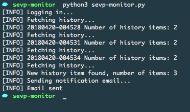
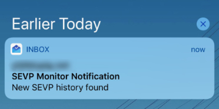

# SEVP History Monitor

A script that monitors and notifies SEVP profile changes which is an indicator of H-1B lottery status.

The script keeps monitoring the number of profile change history and sends notification when new change history is found.

## Screenshots

Running



Email notification




## Usage

#### 1. Configure

Configure your SEVP login email and password (**required**)

```python
# SEVP user configurations
sevp_email = 'user@someschool.edu'
sevp_password = 'password'
```

Configure SMTP information (for email notifications, **optional**)

This assumes TLS is enabled and port `587` is used.

```python
# Email notification configurations (optional)
notification_email_address = '<YOUR_EMAIL_ADDRESS>'
smtp_server = '<SMTP_SERVER_ADDRESS>'
smtp_user = '<SMTP_USER>'
smtp_password = '<SMTP_PASSWORD>'
```

#### 2. Run

```
python3 sevp-monitor.py
```

## Questions?

Create an [issue](https://github.com/yunzhu-li/sevp-monitor/issues/new).
